# Database Schema & Data Model Specification

**Document Version**: 2.0.0  
**Date**: 2026-08-04  
**Status**: Approved Specification (Production Database Architecture)  
**Author**: Authn Core Team  

---

## 1. Overview & Technology Selection

The **Authn** database layer is designed using **Ent ORM** (`entgo.io`), Meta's type-safe entity framework for Go. Ent provides compile-time query safety, high performance with zero runtime reflection, and native support for multiple SQL engines.

### Supported SQL Engines
* **PostgreSQL 14+** (Recommended for Enterprise / Production)
* **SQLite 3** (Ideal for single-binary self-hosting and local dev)
* **MySQL 8.0+ / MariaDB**
* **CockroachDB**

### Core Architectural Patterns
1. **Ent Privacy Interceptors**: Enforces multi-tenancy and environment isolation automatically at the query builder layer. Every query implicitly appends `WHERE tenant_id = ? AND environment = ?`.
2. **`ClientFactory` Connection Pooling**: Database connection initialization is wrapped in a `ClientFactory` interface, allowing logical multi-tenancy by default and seamless physical DB connection pool routing for Enterprise deployments without schema changes.
3. **KMS / Environment Key Field Encryption**: Passwords use **RFC 9106 Argon2id**. Secret API keys (`sk_...`) use **HMAC-SHA256 with a server-side pepper** (`AUTHN_API_KEY_PEPPER`). OAuth third-party tokens, WebAuthn credentials, TOTP secrets, and guardian SSS key shares use **AES-256-GCM** encryption using keys injected from environment/KMS (`AUTHN_ENCRYPTION_KEY`), never stored raw in the database. Session refresh tokens and cancellation tokens are stored strictly as SHA-256 hashes.
4. **GDPR Anonymization Policy**: User account deletion sets `user_id = NULL` on historical `AuditLog` records, preserving security audit history while completely removing PII.
5. **Guardian SSS Re-Key / Re-Split Rule**: Removing or un-enrolling a guardian marks all previous shares for that user as `revoked` and forces a full $k$-of-$N$ re-enrollment split with fresh keys to maintain cryptographic threshold integrity.

---

## 2. Entity-Relationship Diagram (ERD)

```mermaid
erDiagram
    Tenant ||--|{ Application : "owns"
    Application ||--|{ ApiKey : "contains"
    Tenant ||--|{ User : "contains"
    Tenant ||--|{ Organization : "contains"
    Organization ||--|{ OrgMember : "has"
    Organization ||--|{ OrgInvitation : "sends"
    Tenant ||--|{ Role : "defines"
    Role ||--|{ Permission : "grants"
    User ||--|{ UserRole : "assigned"
    User ||--|{ Identity : "has linked"
    User ||--|{ Session : "maintains"
    User ||--|{ TwoFactorMethod : "configures"
    User ||--|{ PushDevice : "registers"
    User ||--|{ TrustedDevice : "trusts"
    User ||--|{ UserIpSubnetHistory : "tracks subnet"
    User ||--|{ RecoveryContact : "pre-enrolls"
    User ||--|{ UserPasswordHistory : "retains history"
    User ||--|{ RecoveryRequest : "executes recovery"
    Tenant ||--|{ SecurityBlacklist : "blacklists"
    Tenant ||--|{ WebhookEndpoint : "configures"
    WebhookEndpoint ||--|{ WebhookEvent : "dispatches"
    Tenant ||--|{ AuditLog : "logs"

    Tenant {
        string id PK
        string name
        string slug UK
        string custom_domain UK
        boolean domain_verified
        string domain_verification_token
        json branding_config
        json password_policy
        json security_policy
        json recovery_policy
        timestamp created_at
        timestamp updated_at
    }

    Organization {
        string id PK
        string tenant_id FK
        string name
        string slug UK
        string logo_url
        json metadata
        timestamp created_at
    }

    OrgMember {
        string id PK
        string organization_id FK
        string user_id FK
        string role_id FK
        string assigned_by_user_id FK
        string updated_by_user_id FK
        timestamp created_at
        timestamp updated_at
    }

    OrgInvitation {
        string id PK
        string organization_id FK
        string email
        string role_id FK
        string invited_by_user_id FK
        string invitation_token UK
        enum status "pending | accepted | expired"
        timestamp expires_at
        timestamp created_at
    }

    Role {
        string id PK
        string tenant_id FK
        string name
        string description
        boolean is_system_role
        timestamp created_at
    }

    Permission {
        string id PK
        string role_id FK
        string action
        string description
        timestamp created_at
    }

    UserRole {
        string id PK
        string user_id FK
        string role_id FK
        string assigned_by_user_id FK
        string updated_by_user_id FK
        timestamp created_at
        timestamp updated_at
    }

    Application {
        string id PK
        string tenant_id FK
        string name
        enum environment "test | live"
        string_array allowed_cors_origins
        string_array exact_redirect_uris
        timestamp created_at
        timestamp updated_at
    }

    ApiKey {
        string id PK
        string application_id FK
        enum type "publishable | secret"
        string key_prefix "pk_test_ | pk_live_ | sk_test_ | sk_live_"
        string key_hash UK "HMAC-SHA256 with server pepper"
        string name
        enum environment "test | live"
        timestamp expires_at
        timestamp last_used_at
        timestamp revoked_at
        timestamp created_at
    }

    User {
        string id PK
        string tenant_id FK
        enum environment "test | live"
        string email
        string username UK
        string password_hash
        boolean email_verified
        string phone_number
        boolean phone_verified
        string name
        string avatar_url
        string locale
        enum status "active | banned | recovery_hold"
        int recovery_failed_attempts
        timestamp recovery_lockout_until
        boolean security_review_required
        timestamp last_sign_in_at
        json metadata
        timestamp created_at
        timestamp updated_at
    }

    RecoveryRequest {
        string id PK
        string user_id FK
        string initiated_from_ip
        string initiated_from_subnet
        string initiated_from_user_agent
        boolean is_trusted_device_origin
        enum proof_method_used "guardian_consensus | phone_otp | email_otp | old_password | security_questions"
        enum status "initiated | awaiting_proof | proof_verified | freeze_active | ready_for_claim | completed | cancelled | expired"
        int submitted_shares_count
        json submitted_share_indexes
        timestamp freeze_started_at
        timestamp freeze_expires_at
        string cancellation_token_hash UK
        string claim_token_hash UK
        timestamp claim_token_expires_at
        timestamp completed_at
        timestamp cancelled_at
        timestamp created_at
    }

    SecurityBlacklist {
        string id PK
        string tenant_id FK
        string user_id FK
        string ip_address
        string subnet
        string fingerprint_hash
        string reason
        timestamp expires_at
        timestamp created_at
    }

    RecoveryContact {
        string id PK
        string user_id FK
        int share_index
        string contact_name
        string contact_email
        string contact_phone
        string share_hash UK
        enum status "pending | active | revoked"
        string invite_token_hash UK
        timestamp invite_expires_at
        timestamp created_at
        timestamp updated_at
    }

    TrustedDevice {
        string id PK
        string user_id FK
        string device_token_hash UK
        string device_name
        string fingerprint_hash
        string last_ip_address
        string last_ip_subnet
        enum status "active | revoked"
        timestamp last_seen_at
        timestamp expires_at
        timestamp created_at
    }

    UserIpSubnetHistory {
        string id PK
        string user_id FK
        string subnet
        int ip_version
        int login_count
        timestamp first_seen_at
        timestamp last_seen_at
    }

    UserPasswordHistory {
        string id PK
        string user_id FK
        string password_hash
        timestamp created_at
    }

    TwoFactorMethod {
        string id PK
        string user_id FK
        enum method_type "totp | sms_otp | backup_codes | webauthn | push_prompt"
        string secret_enc
        string phone_number
        json backup_codes_hashes
        json passkey_credential
        boolean is_default
        enum status "pending | active | disabled"
        timestamp created_at
        timestamp updated_at
    }

    WebhookEndpoint {
        string id PK
        string tenant_id FK
        string url
        string description
        string secret_key_enc
        string secret_key_hash UK
        json subscribed_events
        boolean is_active
        int failure_count
        timestamp created_at
        timestamp updated_at
    }

    WebhookEvent {
        string id PK
        string webhook_endpoint_id FK
        string event_type
        json payload
        int status_code
        string response_body
        string error_message
        enum status "pending | success | failed | retrying"
        timestamp created_at
    }
```

---

## 3. Entity Data Dictionary

### 3.1 `Tenant`
Stores workspace metadata, custom domain settings, and per-tenant policy configurations (`password_policy`, `security_policy`, `recovery_policy`).

### 3.2 `User`
Stores user credentials, RFC 9106 Argon2id password hash, profile metadata, status (`active`, `banned`, `recovery_hold`), exponential lockout timestamp (`recovery_lockout_until`), and security review flag (`security_review_required`).

### 3.3 `RecoveryRequest` (FR-5 State Machine)
Tracks account recovery requests through state transitions:
`initiated` $\to$ `awaiting_proof` $\to$ `proof_verified` $\to$ `freeze_active` (48h) $\to$ `ready_for_claim` (15m claim token) $\to$ `completed` or `cancelled`.

### 3.4 `SecurityBlacklist` (FR-5 7-Day Security Shield)
Stores 7-day multi-dimensional security incident blacklist records (`ip_address`, `subnet`, `fingerprint_hash`, `expires_at`). Prevents subsequent recovery/login attempts from hostile origins following security cancellations.

### 3.5 `RecoveryContact` (Shamir's Secret Sharing)
Stores trusted recovery contacts for pre-enrolled guardian recovery ($GF(2^8)$ Shamir engine). DB persists SHA-256 share hashes (`share_hash`) only. Raw secret shares exist in memory briefly during split computation and zero-knowledge token delivery.

### 3.6 `TrustedDevice` & `UserIpSubnetHistory`
Stores HMAC-SHA256 signed device cookies (`authn_td_token`) and IPv4 (`/24`) / IPv6 (`/48`) subnet history for trust evaluation scoring and old password method unlocking. Purged after a sliding 90-day window per policy.

### 3.7 `TwoFactorMethod`
Stores user 2FA method configurations (`totp`, `sms_otp`, `backup_codes`, `webauthn`). TOTP secrets and WebAuthn credential data are stored AES-256-GCM encrypted.

### 3.8 `WebhookEndpoint` & `WebhookEvent` (FR-13 Real-Time Webhooks)
`WebhookEndpoint` stores HTTPS destination URLs, subscribed event patterns (`user.created`, `session.revoked`, `2fa.enabled`, `*`), and AES-256-GCM encrypted HMAC signing secrets (`whsec_...`) with a unique SHA-256 hash index (`secret_key_hash`) preventing secret collisions across endpoints. `WebhookEvent` stores delivery audit logs, HTTP status codes, payload snapshots, and delivery error messages.

---

## 4. Indexing & Query Optimization Strategy

| Entity | Index Target | Query Pattern Optimization |
| :--- | :--- | :--- |
| `User` | `(tenant_id, environment, email)` | Fast unique user login & signup lookup |
| `User` | `(tenant_id, environment, username)` | Fast profile lookup by username |
| `RecoveryRequest` | `(user_id, status)` | Active recovery request polling |
| `RecoveryRequest` | `cancellation_token_hash` | Single-use signed cancellation link redemption |
| `RecoveryRequest` | `claim_token_hash` | Account claim verification |
| `SecurityBlacklist` | `(tenant_id, user_id, expires_at)` | Fast user origin blacklist lookup |
| `SecurityBlacklist` | `(subnet, expires_at)` | Network-level blacklist check |
| `SecurityBlacklist` | `(fingerprint_hash, expires_at)` | Device fingerprint blacklist check |
| `TrustedDevice` | `(user_id, device_token_hash, status)` | Fast trusted device verification |
| `UserIpSubnetHistory` | `(user_id, subnet, last_seen_at)` | IP subnet familiarity evaluation |
| `RecoveryContact` | `(user_id, status)` | Active guardian retrieval |
| `WebhookEndpoint` | `(tenant_id, is_active)` | Active webhook endpoint resolution during event dispatch |
| `WebhookEndpoint` | `secret_key_hash` | Unique index guaranteeing 0 secret collisions |
| `WebhookEvent` | `(webhook_endpoint_id, created_at)` | Delivery audit log listing & retry scheduling |
