# Database Schema & Data Model Specification

**Document Version**: 1.0.0  
**Date**: 2026-08-01  
**Status**: Approved Specification (Execution Ready)  
**Author**: Authn Core Team  

---

## 1. Overview & Technology Selection

The **Authn** database layer is designed using **Ent ORM** (`entgo.io`), Meta's type-safe entity framework for Go. Ent provides compile-time query safety, high performance with zero runtime reflection, and native support for multiple SQL engines.

### Supported SQL Engines
* **PostgreSQL 14+** (Recommended for Enterprise / Production)
* **SQLite 3** (Ideal for single-binary self-hosting and local dev)
* **MySQL 8.0+ / MariaDB**
* **CockroachDB**

### Core Architectural Patterns
1. **Ent Privacy Interceptors**: Enforces multi-tenancy and environment isolation automatically at the query builder layer. Every query implicitly appends `WHERE tenant_id = ? AND environment = ?`.
2. **`ClientFactory` Connection Pooling**: Database connection initialization is wrapped in a `ClientFactory` interface, allowing logical multi-tenancy by default and seamless physical DB connection pool routing for Enterprise deployments without schema changes.
3. **KMS / Environment Key Field Encryption**: Passwords use **Argon2id**. Secret API keys (`sk_...`) use **HMAC-SHA256 with a server-side pepper** (`AUTHN_API_KEY_PEPPER`). OAuth third-party tokens, WebAuthn credentials, and guardian SSS key shares use **AES-256-GCM** encryption using keys injected from environment/KMS (`AUTHN_ENCRYPTION_KEY`), never stored in the database. Session refresh tokens are stored strictly as SHA-256 hashes.
4. **GDPR Anonymization Policy**: User account deletion sets `user_id = NULL` on historical `AuditLog` records, preserving security audit history while completely removing PII.
5. **Guardian SSS Revocation Rule**: Removing or un-enrolling a guardian marks all previous shares for that user as `revoked` and forces a full 2-of-3 re-enrollment split with new keys to maintain cryptographic threshold integrity.

---

## 2. Entity-Relationship Diagram (ERD)

```mermaid
erDiagram
    Tenant ||--|{ Application : "owns"
    Application ||--|{ ApiKey : "contains"
    Tenant ||--|{ User : "contains"
    Tenant ||--|{ Organization : "contains"
    Organization ||--|{ OrgMember : "has"
    Organization ||--|{ OrgInvitation : "sends"
    Tenant ||--|{ Role : "defines"
    Role ||--|{ Permission : "grants"
    User ||--|{ UserRole : "assigned"
    User ||--|{ Identity : "has linked"
    User ||--|{ Session : "maintains"
    User ||--|{ TwoFactorMethod : "configures"
    User ||--|{ PushDevice : "registers"
    Tenant ||--|{ WebhookEndpoint : "configures"
    WebhookEndpoint ||--|{ WebhookEvent : "dispatches"
    Tenant ||--|{ AuditLog : "logs"

    Tenant {
        string id PK
        string name
        string slug UK
        string custom_domain UK
        boolean domain_verified
        string domain_verification_token
        json branding_config
        timestamp created_at
        timestamp updated_at
    }

    Organization {
        string id PK
        string tenant_id FK
        string name
        string slug UK
        timestamp created_at
    }

    OrgMember {
        string id PK
        string organization_id FK
        string user_id FK
        string role_id FK
        timestamp created_at
    }

    OrgInvitation {
        string id PK
        string organization_id FK
        string email
        string role_id FK
        string invitation_token UK
        enum status "pending | accepted | expired"
        timestamp expires_at
        timestamp created_at
    }

    Role {
        string id PK
        string tenant_id FK
        string name
        string description
        timestamp created_at
    }

    Permission {
        string id PK
        string role_id FK
        string action
        timestamp created_at
    }

    UserRole {
        string id PK
        string user_id FK
        string role_id FK
        timestamp created_at
    }

    Application {
        string id PK
        string tenant_id FK
        string name
        enum environment "test | live"
        string_array allowed_cors_origins
        string_array exact_redirect_uris
        timestamp created_at
        timestamp updated_at
    }

    ApiKey {
        string id PK
        string application_id FK
        enum type "publishable | secret"
        string key_prefix "pk_test_ | pk_live_ | sk_test_ | sk_live_"
        string key_hash UK "HMAC-SHA256 with server pepper"
        enum environment "test | live"
        timestamp expires_at
        timestamp created_at
    }

    User {
        string id PK
        string tenant_id FK
        enum environment "test | live"
        string email UK
        string password_hash
        boolean email_verified
        string name
        string avatar_url
        enum status "active | banned | recovery_hold"
        timestamp created_at
        timestamp updated_at
    }

    Identity {
        string id PK
        string user_id FK
        string provider "google | apple | github | x | facebook | discord"
        string provider_user_id
        string access_token_encrypted
        string refresh_token_encrypted
        timestamp created_at
        timestamp updated_at
    }

    Session {
        string id PK
        string user_id FK
        string refresh_token_hash UK
        enum status "active | rotated_grace | revoked"
        string superseded_by_session_id FK
        string device_fingerprint_hmac
        string ip_address
        string user_agent
        timestamp expires_at
        timestamp grace_expires_at
        timestamp created_at
    }

    TwoFactorMethod {
        string id PK
        string user_id FK
        enum type "push | passkey | totp | sms | backup_code"
        string secret_encrypted
        string credential_id
        bytes public_key
        boolean is_enabled
        timestamp created_at
    }

    WebhookEndpoint {
        string id PK
        string tenant_id FK
        string url
        string secret_key_encrypted
        string_array subscribed_events
        boolean is_active
        timestamp created_at
    }

    WebhookEvent {
        string id PK
        string webhook_endpoint_id FK
        string event_type
        json payload
        integer status_code
        enum status "success | failed"
        timestamp created_at
    }

    AuditLog {
        string id PK
        string tenant_id FK
        string application_id FK
        string user_id FK "nullable on GDPR deletion"
        string event_type
        string ip_address
        string user_agent
        json metadata
        timestamp created_at
    }
```

---

## 3. Entity Field Specifications for New Modules

### 3.1 `Organization` Schema (`apps/auth-engine/ent/schema/organization.go`)
Represents a B2B workspace/team within a tenant.

| Field | Type | Attributes | Description |
| :--- | :--- | :--- | :--- |
| `id` | `string` | PK, Unique | Organization ID (`org_...`) |
| `tenant_id` | `string` | Index, FK -> Tenant.id | Owning tenant ID |
| `name` | `string` | Required | Organization name |
| `slug` | `string` | Unique, Required | URL slug |
| `created_at` | `time` | Default: `Now()` | Creation timestamp |

### 3.2 `Role` Schema (`apps/auth-engine/ent/schema/role.go`)
Represents an RBAC role definition.

| Field | Type | Attributes | Description |
| :--- | :--- | :--- | :--- |
| `id` | `string` | PK, Unique | Role ID (`rol_...`) |
| `tenant_id` | `string` | Index, FK -> Tenant.id | Owning tenant ID |
| `name` | `string` | Required | Role name (e.g. `admin`, `editor`, `viewer`) |
| `description` | `string` | Optional | Role description |
| `created_at` | `time` | Default: `Now()` | Creation timestamp |

### 3.3 `WebhookEndpoint` Schema (`apps/auth-engine/ent/schema/webhookendpoint.go`)
Stores developer-configured HTTP webhook listeners.

| Field | Type | Attributes | Description |
| :--- | :--- | :--- | :--- |
| `id` | `string` | PK, Unique | Webhook ID (`whe_...`) |
| `tenant_id` | `string` | Index, FK -> Tenant.id | Owning tenant ID |
| `url` | `string` | Required | Target HTTP webhook URL |
| `secret_key_encrypted` | `string` | Required | AES-256-GCM encrypted HMAC signing secret |
| `subscribed_events` | `[]string` | Required | Subscribed event array (e.g. `["user.created", "session.revoked"]`) |
| `is_active` | `bool` | Default: `true` | Enabled flag |
| `created_at` | `time` | Default: `Now()` | Creation timestamp |
