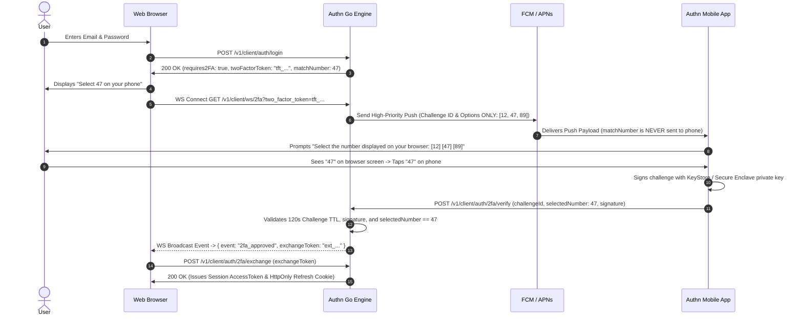

# Mobile Architecture Specification (Android & iOS)

**Document Version**: 1.0.0  
**Date**: 2026-08-01  
**Status**: Approved Specification (Execution Ready)  
**Author**: Authn Core Team  

---

## 1. Overview & Verified Toolchain Versions

The **Authn Mobile Ecosystem** consists of native mobile applications (`apps/mobile-android` and `apps/mobile-ios`) built using the latest toolchains:
* **Android**: Kotlin `2.1.0+` (K2 compiler), Gradle `8.12+`, Android Gradle Plugin (AGP) `8.8+`, JDK `17+`.
* **iOS**: Swift `6.0+` (Swift 6 strict concurrency safety), Xcode `16.0+`, iOS SDK `18.0+`.

### Core Capabilities
1. **Authenticator & Real-Time Push 2FA**: Push notification 2FA prompts with number-matching verification to prevent Push Fatigue attacks.
2. **On-Device System Single Sign-On (SSO)**: Native Android `AccountManager` integration and iOS Shared Keychain Groups for instant token sharing between installed companion apps.

*(Note: All API JSON payloads use camelCase exclusively)*

---

## 2. Push 2FA & Number-Matching Security Protocol

### 2.1 Sequence Diagram & WebSocket Protocol



### 2.2 FCM / APNs Push Payload Schema (No Answer Leakage)

To prevent automated mobile malware or bypassed prompts from auto-selecting the answer, the push payload **NEVER contains `matchNumber`**. The target number exists solely on the browser display and the backend server.

```json
{
  "authnEvent": "2fa_prompt",
  "challengeId": "chl_8f7e6d5c4b3a",
  "appName": "Acme SaaS Web App",
  "deviceInfo": "Chrome on macOS 14.5",
  "ipAddress": "198.51.100.42",
  "location": "London, UK",
  "timestamp": 1722384000,
  "options": [12, 47, 89]
}
```

---

## 3. Android System `AccountManager` & Package Signature Security (`Kotlin 2.1+ / Gradle 8.12+`)

### 3.1 Caller Verification Policy (`apps/mobile-android`)
- **Authenticator Service**: Extends `android.accounts.AbstractAccountAuthenticator`.
- **Package Signature Checking**: `getAuthToken()` verifies the calling package name using `PackageManager.getPackageInfo(callingPackage, GET_SIGNATURES)`. Token issuance is granted ONLY if the caller's signing certificate matches the registered first-party application certificate, preventing malicious apps on the device from silently extracting tokens.
- **Token Fetch Sample (Kotlin 2.1+)**:
  ```kotlin
  val accountManager = AccountManager.get(context)
  val accounts = accountManager.getAccountsByType("com.authn.account")
  accountManager.getAuthToken(accounts[0], "api_access", null, activity, { future ->
      val authToken = future.result.getString(AccountManager.KEY_AUTHTOKEN)
  }, null)
  ```

---

## 4. iOS `ASWebAuthenticationSession` & Secure Enclave Binding (`Swift 6.0+`)

### 4.1 Architecture (`apps/mobile-ios`)
- **Web Auth Session**: Uses `ASWebAuthenticationSession` for PKCE browser login flows.
- **Shared Keychain Group**: `com.authn.sharedkeychain`
- **Strict Biometric Binding (`biometryCurrentSet`)**: Tokens are stored in iOS Keychain using `kSecAccessControlBiometryCurrentSet`. If a new FaceID/TouchID biometric enrollment is added to the iOS device, the stored refresh token is invalidated automatically to prevent unauthorized access.
